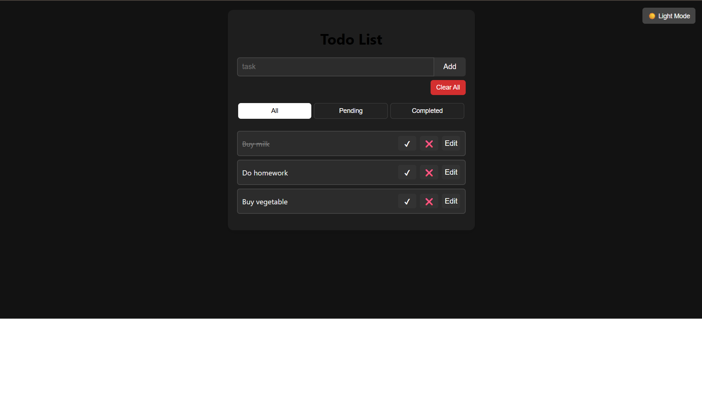

# 📝 Todo App

A clean, responsive and interactive Todo List Web App built with **HTML, CSS, and JavaScript**.

## 🌟 Features

- ✅ Add, edit, delete, and mark tasks as completed
- 🎯 Filter tasks (All | Completed | Pending)
- 🧹 "Clear All" button with confirmation
- 🎨 Light/Dark theme toggle
- 📱 Responsive design for mobile and desktop
- ✨ Smooth animations on task add/remove

---

## 📸 Screenshots

### 🌞 Light Mode


### 🌙 Dark Mode


---

## 🚀 Live Demo

Check out the live version here:  
👉 [https://mayank26202.github.io/todo-app/](https://mayank26202.github.io/todo-app/)

---

## 📂 Technologies Used

- **HTML**
- **CSS** (with transitions and animations)
- **Vanilla JavaScript**

---

## 📦 How to Run Locally

1. Clone the repository:
   ```bash
   git clone https://github.com/mayank26202/todo-app.git
   cd todo-app
